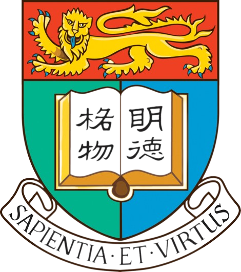

<section class="hero" id="about">
  

    
Human–Computer Interaction · Affective Computing · AI for Healthcare

    <h1>Le Fang</h1>
    
I am a Ph.D. student in Intelligent System and Interaction Design at <a href="https://www.polyu.edu.hk/en/" target="_blank" rel="noopener">The Hong Kong Polytechnic University</a>, supervised by <a href="https://www.polyu.edu.hk/sd/people/academic-staff/wang-stephen-jia/" target="_blank" rel="noopener">Prof. Stephen Jia Wang</a> and co-supervised by <a href="https://thfl.tsinghua.edu.cn/en/yjdw/jzg/Central_Organization/Human_Computer_Interaction__and_User_Experience/Resercher/Yingqing_Xu.htm" target="_blank" rel="noopener">Prof. Ying-Qing Xu</a>.

    
My research lies at the intersection of multimodal interaction, HCI, AI, and data mining. I design practical healthcare technologies that translate computational advances into meaningful real-world impact.

    

      <a href="mailto:lefang@connect.hku.hk">Email</a>
      <a href="https://scholar.google.com/citations?user=AX-EmRgAAAAJ" target="_blank" rel="noopener">Google Scholar</a>
      <a href="https://orcid.org/0000-0003-1860-4008" target="_blank" rel="noopener">ORCID</a>
      <a href="https://www.linkedin.com/in/le-fang-345213205/" target="_blank" rel="noopener">LinkedIn</a>
    

  

  <figure class="portrait">
    
    <figcaption>Le (Leo) Fang</figcaption>
  </figure>
</section>

<section class="content-section" id="news">
  

Updates
<h2>News</h2>

  
</section>







<section class="content-section" id="education">
  

Background
<h2>Education & visits</h2>

  

    <article>
<h3>The Hong Kong Polytechnic University</h3>
Ph.D. in Intelligent System and Interaction Design · 2023–Present

</article>
    <article>
<h3>The University of Tokyo</h3>
Visiting Ph.D. Student · Jan–Jun 2026

</article>
    <article>
<h3>The University of Hong Kong</h3>
M.Phil. in Computer Science · 2019–2021

</article>
    <article>
<h3>National University of Singapore</h3>
Visiting Scholar in Computing · 2018–2019

</article>
    <article>
<h3>Zhejiang University</h3>
B.Eng. in Information Engineering · 2015–2019

</article>
  

</section>
